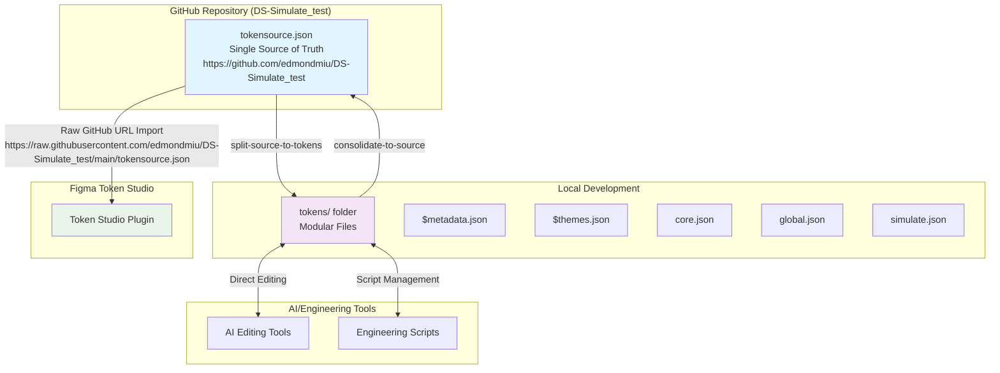

# Design Document

## Overview

The Token Studio Native Workflow system creates a streamlined, GitHub-centered approach to design token management that leverages Token Studio's native export format for modular editing while maintaining tokensource.json as the single source of truth. This design eliminates the complexity of managing multiple transformation layers and creates a more intuitive workflow for both designers and engineers.

## Architecture

### Repository Configuration

**Primary Repository**: `https://github.com/edmondmiu/DS-Simulate_test`
- **tokensource.json**: Canonical source file accessible via raw GitHub URL
- **Designer Import URL**: `https://raw.githubusercontent.com/edmondmiu/DS-Simulate_test/main/tokensource.json`
- **Branch Strategy**: Main branch serves as production source for designers
- **Access Pattern**: Public repository allows direct Token Studio import without authentication

### System Components



### Data Flow Architecture

1. **GitHub as Central Hub**: tokensource.json at `https://github.com/edmondmiu/DS-Simulate_test` serves as the canonical source accessible to all stakeholders
2. **Modular Editing Layer**: Token Studio's native format enables focused editing without complex transformations
3. **Bidirectional Sync**: Clean split/consolidate operations maintain data integrity
4. **Direct Designer Access**: Figma designers import directly from `https://raw.githubusercontent.com/edmondmiu/DS-Simulate_test/main/tokensource.json`

## Components and Interfaces

### Core Transformation Engine

**Purpose**: Handles splitting and consolidation between tokensource.json and modular Token Studio format

**Interface**:
```javascript
class TokenTransformationEngine {
  // Split tokensource.json into Token Studio modular format
  splitSourceToTokens(sourcePath, outputDir) {
    // Returns: { success: boolean, files: string[], errors: string[] }
  }
  
  // Consolidate modular files back to tokensource.json
  consolidateToSource(tokensDir, outputPath) {
    // Returns: { success: boolean, tokensCount: number, errors: string[] }
  }
  
  // Validate transformation integrity
  validateTransformation(originalSource, reconstitutedSource) {
    // Returns: { isValid: boolean, differences: object[], warnings: string[] }
  }
}
```

**Key Responsibilities**:
- Parse tokensource.json structure and map to Token Studio format
- Generate proper $metadata.json with tokenSetOrder
- Create $themes.json with theme configurations and Figma references
- Split tokens into appropriate files (core.json, global.json, etc.)
- Reverse process for consolidation
- Maintain token references and relationships

### File Structure Manager

**Purpose**: Manages the Token Studio file structure and ensures consistency

**Interface**:
```javascript
class FileStructureManager {
  // Initialize tokens folder with proper structure
  initializeTokensFolder(tokensDir) {
    // Returns: { success: boolean, structure: object }
  }
  
  // Validate Token Studio file structure
  validateStructure(tokensDir) {
    // Returns: { isValid: boolean, missingFiles: string[], issues: string[] }
  }
  
  // Get file mapping for token sets
  getTokenSetMapping() {
    // Returns: { [tokenSetName]: string } // filename mapping
  }
}
```

**File Structure**:
```
tokens/
├── $metadata.json          # Token set order and configuration
├── $themes.json            # Theme definitions and Figma references
├── core.json               # Foundation tokens (Color Ramp, primitives)
├── global.json             # Semantic tokens (header, body, spacing)
├── simulate.json           # Brand-specific tokens
├── components.json         # Component-specific tokens (if needed)
└── [additional-sets].json  # Other token sets as needed
```

### Workflow Command Interface

**Purpose**: Provides simple commands for managing the GitHub-centered workflow

**Commands**:

```bash
# Primary workflow commands
npm run split-source-to-tokens     # tokensource.json → tokens/ folder
npm run consolidate-to-source      # tokens/ folder → tokensource.json
npm run sync-from-github          # Pull latest and split for editing
npm run validate-workflow-integrity # Test complete workflow

# Supporting commands  
npm run workflow:start            # Complete setup for editing session
npm run workflow:finish          # Consolidate and validate for commit
```

**Implementation**:
```javascript
// scripts/workflow-commands.js
class WorkflowCommands {
  async splitSourceToTokens() {
    // 1. Validate tokensource.json exists and is valid
    // 2. Create/clean tokens/ directory
    // 3. Split source using TransformationEngine
    // 4. Validate output structure
    // 5. Report success/errors
  }
  
  async consolidateToSource() {
    // 1. Validate tokens/ folder structure
    // 2. Consolidate using TransformationEngine  
    // 3. Validate resulting tokensource.json
    // 4. Create backup of previous version
    // 5. Update source file
  }
  
  async syncFromGithub() {
    // 1. Git pull latest changes from DS-Simulate_test repository
    // 2. Automatically run split-source-to-tokens
    // 3. Report status and readiness for editing
    // 4. Confirm tokensource.json is ready for designer import
  }
}
```

### Validation System

**Purpose**: Ensures data integrity throughout the workflow

**Components**:

1. **Structure Validator**: Ensures Token Studio format compliance
2. **Reference Validator**: Checks token references resolve correctly  
3. **Roundtrip Validator**: Tests split → consolidate produces equivalent results
4. **Theme Validator**: Ensures theme configurations remain intact

**Interface**:
```javascript
class ValidationSystem {
  validateTokenStudioStructure(tokensDir) {
    // Validates $metadata.json, $themes.json, and token files
  }
  
  validateTokenReferences(tokensDir) {
    // Ensures all {token.reference} resolve correctly
  }
  
  validateRoundtripIntegrity(sourcePath) {
    // Tests: source → split → consolidate → compare
  }
  
  validateThemeCompleteness(tokensDir) {
    // Ensures all themes have required tokens
  }
}
```

## Data Models

### Token Studio Metadata Structure

```json
{
  "tokenSetOrder": [
    "core",
    "global", 
    "simulate",
    "components"
  ]
}
```

### Theme Configuration Structure

```json
[
  {
    "id": "unique-theme-id",
    "name": "Base",
    "selectedTokenSets": {
      "core": "source",
      "global": "enabled",
      "simulate": "enabled"
    },
    "$figmaStyleReferences": {
      "token.name": "figma-style-id"
    }
  }
]
```

### Token File Structure

```json
{
  "tokenGroup": {
    "tokenName": {
      "$type": "color|typography|spacing|etc",
      "$value": "#ffffff|{reference.token}|computed-value",
      "$description": "Human readable description"
    }
  }
}
```

## Error Handling

### Transformation Errors

1. **Invalid Source Structure**: Clear error messages with specific issues
2. **Missing Token References**: Report unresolved references with suggestions
3. **File System Errors**: Handle permissions, disk space, file locks
4. **Validation Failures**: Detailed reporting with actionable fixes

### Recovery Strategies

1. **Backup System**: Automatic backups before major operations
2. **Rollback Capability**: Restore previous working state
3. **Partial Recovery**: Continue processing valid tokens when some fail
4. **Validation Checkpoints**: Stop processing if critical validations fail

## Testing Strategy

### Unit Tests

1. **Transformation Engine**: Test split and consolidate operations
2. **File Structure Manager**: Test structure validation and initialization
3. **Validation System**: Test all validation scenarios
4. **Command Interface**: Test all workflow commands

### Integration Tests

1. **Complete Workflow**: Test full split → edit → consolidate cycle
2. **GitHub Integration**: Test sync-from-github workflow
3. **Token Studio Compatibility**: Test import/export with actual Token Studio
4. **Multi-theme Scenarios**: Test complex theme configurations

### End-to-End Tests

1. **Designer Workflow**: Test complete designer import process
2. **Engineer Workflow**: Test complete engineering editing process  
3. **AI Workflow**: Test programmatic editing scenarios
4. **Error Recovery**: Test error scenarios and recovery processes

### Performance Tests

1. **Large Token Sets**: Test with realistic token volumes
2. **Complex References**: Test deeply nested token references
3. **Multiple Themes**: Test performance with many theme variations
4. **Concurrent Operations**: Test multiple users/processes

## Migration Strategy

### Phase 1: Implementation
- Build new transformation engine and workflow commands
- Create comprehensive test suite
- Validate against current tokensource.json

### Phase 2: Parallel Operation  
- Run new workflow alongside existing scripts
- Validate output equivalence
- Train team on new commands

### Phase 3: Script Consolidation
- Replace old bidirectional sync scripts
- Remove redundant transformation scripts
- Update documentation and workflows

### Phase 4: Cleanup
- Remove obsolete scripts and files
- Finalize documentation
- Archive old workflow documentation

## Security Considerations

1. **GitHub Access**: Ensure proper authentication for repository access
2. **File Permissions**: Validate write permissions before operations
3. **Input Validation**: Sanitize all file inputs and token values
4. **Backup Security**: Secure backup files and cleanup old backups

## Performance Considerations

1. **Incremental Processing**: Only process changed files when possible
2. **Caching**: Cache parsed structures to avoid repeated parsing
3. **Streaming**: Use streaming for large file operations
4. **Parallel Processing**: Process independent token sets in parallel

This design creates a robust, maintainable system that simplifies the design token workflow while maintaining all necessary functionality for a production design system.